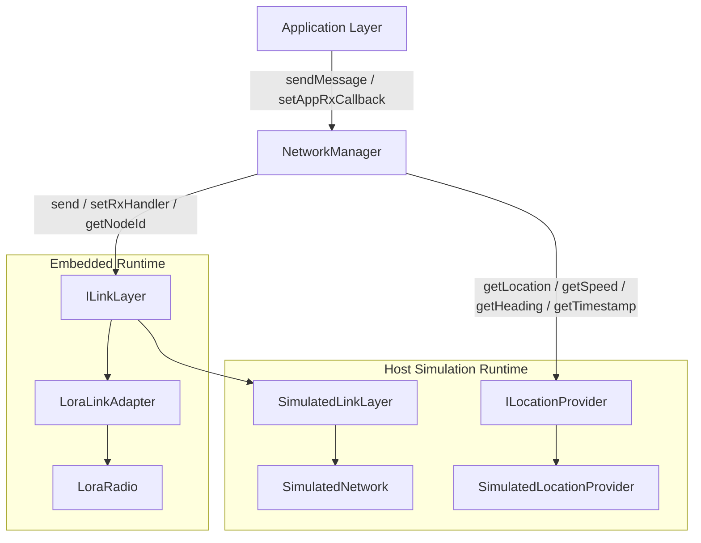
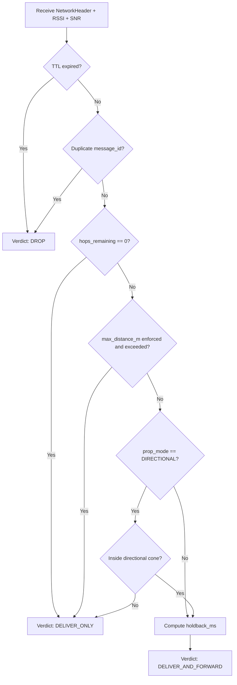
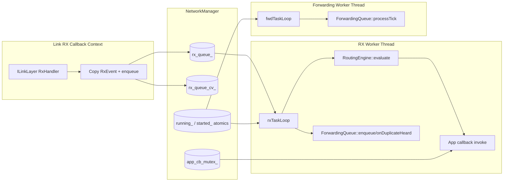
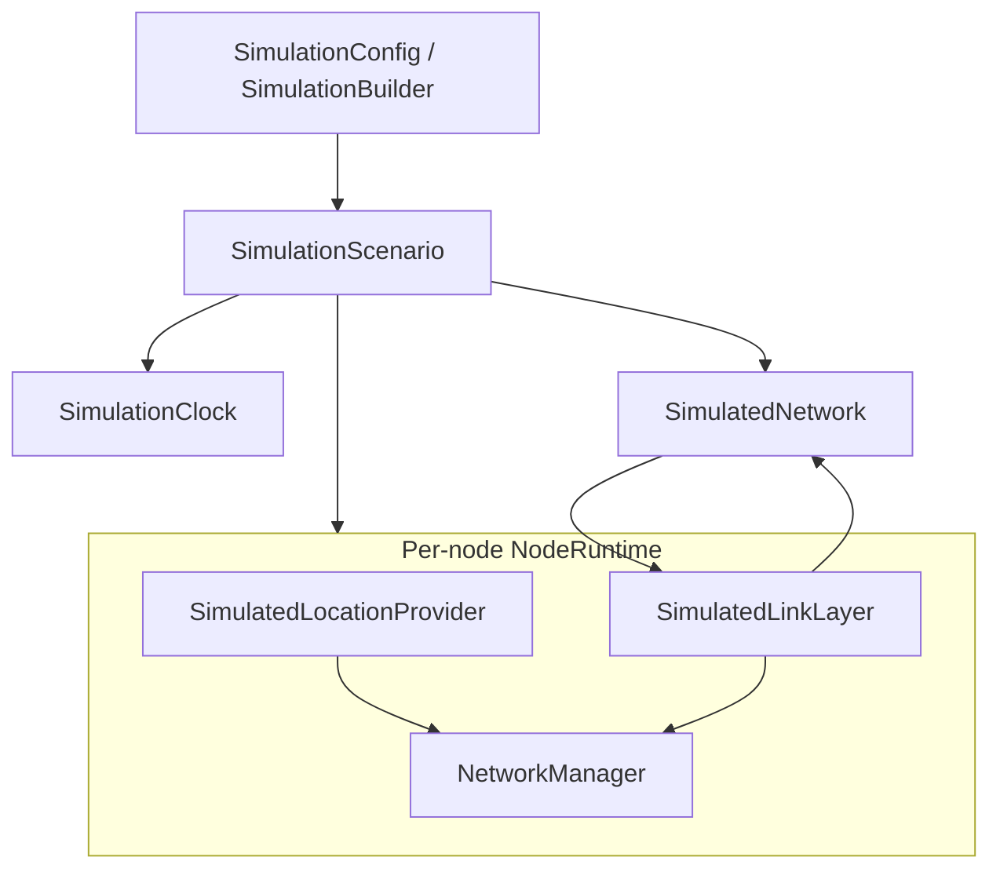

# Network Layer Architecture

## 1. Architectural Scope and Layer Boundaries

This repository implements the Network Layer of a LoRa-based V2V stack. The layer is centered on `NetworkManager`, which coordinates message origination, reception, routing evaluation, duplicate suppression, and relay scheduling.

At the upper boundary, the application interacts through:

- `NetworkManager::sendMessage(...)` for outbound payload injection.
- `NetworkManager::setAppRxCallback(...)` for delivered inbound payloads.

At the lower boundary, the layer depends on abstractions:

- `ILinkLayer` for raw frame transmit/receive and node identity.
- `ILocationProvider` for geospatial and temporal context used by routing and header stamping.

The abstraction strategy decouples the portable core from hardware specifics. Two concrete link adapters are present:

- `LoraLinkAdapter` for ESP32/LoRa radio integration.
- `SimulatedLinkLayer` for deterministic host simulation.

This enables the same network-layer logic to execute in both embedded and host-simulated environments without modifying core routing code.

### Diagram A — Layer Boundary and Dependency View



## 2. Network Frame Model and Message Semantics

The network layer transmits a packed `NetworkHeader` followed by application payload bytes in a single LoRa frame. The header size is constrained to exactly 45 bytes (`static_assert(sizeof(NetworkHeader) == 45)`), and the maximum application payload is derived from the LoRa payload ceiling:

- `LORA_MAX_PAYLOAD = 247` bytes.
- `NET_MAX_APP_PAYLOAD = 247 - 45 = 202` bytes.

The header combines identity, temporal validity, mobility metadata, and forwarding controls:

- **Identity and urgency**: `message_id`, `priority`.
- **Temporal validity**: `timestamp`, `lifetime_s`.
- **Origin context**: `origin_*` fields preserve source position/speed/heading.
- **Per-hop transmitter context**: `tx_*` fields are rewritten by each relay.
- **Propagation constraints**: `prop_mode`, `target_heading`, `hops_remaining`, `max_distance_m`.

`message_id` is generated during origination as:

- `(node_id << 16) | sequence_counter`.

This makes each message unique per source node over the sequence window and enables duplicate suppression by `message_id`.

Serialization behavior is explicit and symmetric:

- On originate (`NetworkManager::sendMessage`), header and payload are copied into a contiguous transmit buffer and broadcast through `ILinkLayer`.
- On relay fire (`ForwardingQueue::fireEntry`), `hops_remaining` is decremented, `tx_*` fields are updated from current node kinematics, and the updated header is re-serialized with the original payload for rebroadcast.

Semantic distinction between immutable and mutable location metadata is central to routing behavior:

- `origin_*` remains stable across the message lifetime.
- `tx_*` reflects the most recent transmitter and is therefore the basis for next-hop hold-back and redundancy cancellation logic.

## 3. Core Runtime Components and Responsibilities

The network layer is structured as a small set of focused components composed by `NetworkManager`.

### `NetworkManager`

`NetworkManager` is the runtime coordinator. It owns:

- one duplicate cache (`DuplicateFilter`),
- one routing evaluator (`RoutingEngine`),
- one deferred relay scheduler (`ForwardingQueue`),
- one bounded RX event queue and worker threads.

It exposes the external API surface to the application and performs message serialization/deserialization at ingress and egress boundaries.

### `DuplicateFilter`

`DuplicateFilter` implements a fixed-size, mutex-protected `message_id` cache with oldest-entry replacement. It is used in two places:

- During origination (`markSeen`) to suppress self-reception loops.
- During reception (`isDuplicate`) as a first-order replay gate.

### `RoutingEngine`

`RoutingEngine` is a stateless policy evaluator over header metadata plus receive quality (`RSSI`, `SNR`) and local node state (`ILocationProvider`). It returns:

- `DROP`,
- `DELIVER_ONLY`,
- `DELIVER_AND_FORWARD` with computed hold-back delay.

This separates routing policy from queueing and thread orchestration concerns.

### `ForwardingQueue`

`ForwardingQueue` stores relay candidates in a fixed slot array with hold-back deadlines. It provides:

- deferred relay execution (`processTick`),
- priority-aware behavior under queue pressure (conditional replacement),
- implicit cancellation when a duplicate indicates an upstream relay already covered the path.

### `geo_utils`

`geo_utils` supplies deterministic geometric primitives used by routing and relay suppression:

- great-circle distance,
- bearing computation,
- directional cone inclusion,
- geometric betweenness on the origin-transmitter segment.

The component decomposition yields a clear control split:

- `NetworkManager`: lifecycle and data-plane orchestration.
- `RoutingEngine`: routing verdict logic.
- `DuplicateFilter`: idempotency/replay protection.
- `ForwardingQueue`: relay timing and suppression.
- `geo_utils`: geometric decision support.

## 4. End-to-End Data Flow

The runtime data plane is split into two major paths: message origination and message reception/relay.

Outbound origination starts synchronously in `sendMessage(...)`. The manager constructs the header, records the new `message_id` in the duplicate cache, serializes header + payload, and sends one broadcast frame through the link interface.

Inbound processing is asynchronous. The link-layer RX callback only copies incoming bytes into an `RxEvent` and pushes it onto a bounded queue. The RX worker thread then parses the header, runs duplicate-heard cancellation against pending relays, evaluates routing policy, delivers to the application callback when permitted, and conditionally schedules deferred forwarding.

Deferred forwarding is executed by a second worker thread (`fwdTaskLoop`) that periodically ticks `ForwardingQueue::processTick()`. Due entries are emitted as updated relay frames.

### Diagram B — Outbound Message Sequence

```mermaid
sequenceDiagram
    participant App as Application
    participant NM as NetworkManager
    participant Loc as ILocationProvider
    participant Dup as DuplicateFilter
    participant Link as ILinkLayer

    App->>NM: sendMessage(priority, mode, ..., payload)
    NM->>NM: validate payload_len <= NET_MAX_APP_PAYLOAD
    NM->>Link: getNodeId()
    NM->>Loc: getTimestamp(), getLocation(), getSpeed(), getHeading()
    NM->>NM: build NetworkHeader
    NM->>Dup: markSeen(message_id)
    NM->>NM: serialize [NetworkHeader | payload]
    NM->>Link: send(BROADCAST_ADDR, buffer, total_len)
    Link-->>NM: status (0 / error)
    NM-->>App: NetworkError
```

### Diagram C — Inbound RX + Routing + Forwarding Sequence

```mermaid
sequenceDiagram
    participant Link as ILinkLayer RX callback
    participant NM as NetworkManager
    participant RXQ as RX Queue
    participant FQ as ForwardingQueue
    participant RE as RoutingEngine
    participant App as AppRxCallback

    Link->>NM: RxHandler(data, len, rssi, snr)
    NM->>RXQ: enqueue RxEvent (drop if queue full)
    NM->>RXQ: notify_one()

    NM->>RXQ: rxTaskLoop dequeues event
    NM->>NM: parse NetworkHeader + app payload
    NM->>FQ: onDuplicateHeard(hdr)
    NM->>RE: evaluate(hdr, rssi, snr)
    RE-->>NM: EvalResult(verdict, holdback_ms)

    alt verdict == DROP
        NM->>NM: discard frame
    else verdict == DELIVER_ONLY
        NM->>App: deliver(hdr, payload)
    else verdict == DELIVER_AND_FORWARD
        NM->>App: deliver(hdr, payload)
        NM->>FQ: enqueue(hdr, payload, holdback_ms)
    end

    loop every ~10 ms in fwdTaskLoop
        NM->>FQ: processTick()
        FQ->>Link: send(BROADCAST_ADDR, relayed_frame)
    end
```

## 5. Routing Decision Pipeline

`RoutingEngine::evaluate(...)` applies an ordered gate sequence and emits both a verdict and (when applicable) a forwarding delay.

Evaluation order is deterministic:

1. **TTL check**: if both local and header timestamps are known, drop when `timestamp + lifetime_s < now`.
2. **Duplicate check**: drop when `message_id` already exists in duplicate cache.
3. **Hop budget check**: if `hops_remaining == 0`, deliver only.
4. **Max-distance check**: if `max_distance_m > 0` and local distance from origin exceeds it, deliver only.
5. **Directional cone check** (`DIRECTIONAL` mode only): if local position is outside the target cone, deliver only.
6. **Forwarding qualification**: if all gates pass, return `DELIVER_AND_FORWARD` and compute hold-back.

Hold-back computation blends path-progress and signal quality:

- Uses distance from current node to last transmitter (`txPoint`) relative to an estimated range.
- Uses normalized SNR and RSSI with equal weights.
- Maps combined score into `[CONFIG_NET_HOLDBACK_MIN_MS, CONFIG_NET_HOLDBACK_MAX_MS]`.
- Applies priority multiplier (`EMERGENCY` shortest, `LOW` longest).

This design causes weaker/farther receivers to relay earlier while preserving priority differentiation for urgent traffic.

### Diagram D — Routing Decision Flowchart



## 6. Forwarding Strategy and Redundancy Control

The forwarding subsystem is designed to reduce redundant rebroadcasts while preserving time-critical traffic.

### Deferred relay with bounded storage

Each forwarding candidate is stored as a `PendingRelay` entry containing header, payload copy, and fire timestamp. Storage is a fixed array with compile-time bound (`CONFIG_NET_FORWARDING_QUEUE_SIZE`) and runtime capacity assertion.

### Queue-pressure policy

On enqueue:

- A free slot is used when available.
- If full, the queue identifies the current lowest-priority entry (largest numeric `priority`).
- Replacement occurs only if the incoming message has higher priority (smaller numeric value).
- Otherwise, the incoming relay is dropped.

This behavior protects high-priority propagation under constrained relay memory.

### Timer-driven relay emission

`processTick()` snapshots all due entries under lock, marks them inactive, and fires them outside the lock. Fire behavior:

- decrements `hops_remaining` when positive,
- rewrites `tx_*` fields from current local kinematics,
- serializes updated header + payload,
- broadcasts via link layer.

### Implicit cancellation by geometric betweenness

When any duplicate is heard, `onDuplicateHeard(...)` checks queued entries with same `message_id`. If local node is geometrically between message origin and the newly heard transmitter (within configurable threshold), the local queued relay is canceled as unnecessary.

This mechanism implements suppression without explicit coordination frames and leverages spatial progression inferred from `txPoint`.

### Diagram E — Forwarding Queue Lifecycle

```mermaid
flowchart TD
    A[enqueue(hdr,payload,holdback)] --> B{Free slot available?}
    B -- Yes --> C[Store entry and fire_time]
    B -- No --> D[Find worst priority active entry]
    D --> E{Incoming priority higher?}
    E -- Yes --> F[Replace worst entry]
    E -- No --> G[Drop incoming relay]

    C --> H[Active pending entry]
    F --> H

    H --> I[processTick()]
    I --> J{now >= fire_time?}
    J -- No --> H
    J -- Yes --> K[fireEntry]
    K --> L[Decrement hops if >0]
    L --> M[Update tx_* from local location]
    M --> N[Serialize and broadcast relay]

    H --> O[onDuplicateHeard(same message_id)]
    O --> P{isBetween(origin, me, heard_tx)?}
    P -- Yes --> Q[Cancel pending relay]
    P -- No --> H
```

## 7. Concurrency, Threading, and Synchronization

The network manager uses a two-worker threading model to decouple I/O ingress, CPU-bound routing decisions, and timer-based forwarding.

### Runtime threads

- **RX worker (`rxTaskLoop`)**: consumes queued `RxEvent` items and executes parse → route → deliver → optional enqueue.
- **Forwarding worker (`fwdTaskLoop`)**: invokes `ForwardingQueue::processTick()` at ~10 ms intervals.

### Callback decoupling

The link-layer RX callback does not run routing logic directly. Instead, it:

1. copies raw frame bytes into `RxEvent`,
2. pushes into bounded RX queue under mutex,
3. notifies condition variable.

This minimizes callback critical-section time and isolates application/link interrupt-like contexts from routing workload.

### Synchronization primitives

- `rx_queue_mutex_` + `rx_queue_cv_`: producer/consumer coordination for inbound events.
- `app_cb_mutex_`: protects callback registration and callback pointer handoff.
- internal mutexes in `DuplicateFilter` and `ForwardingQueue`: protect shared caches/slot pools.
- atomics (`started_`, `running_`, `seq_`): lifecycle and sequence control.

### Lifecycle behavior

- `start()` is idempotent via `started_.exchange(true)`.
- `stop()` sets `running_ = false`, wakes blocked RX waiters, and joins both threads.
- Destructor clears RX handler and invokes `stop()`, ensuring shutdown of background workers.

### Diagram F — Threading and Synchronization View



## 8. Configuration and Operational Constraints

The network layer exposes both runtime and compile-time controls that directly affect capacity, propagation behavior, and timing.

### Runtime configuration (`NetworkConfig`)

Each `NetworkManager` instance is created with:

- `duplicate_cache_size`
- `forwarding_queue_size`
- `rx_queue_depth`

These values determine memory footprint and admission behavior for duplicate suppression, deferred forwarding, and callback-to-worker buffering.

### Compile-time defaults and hard bounds

Default macros in core sources establish baseline behavior when no external configuration is supplied:

- `CONFIG_NET_DUPLICATE_CACHE_SIZE = 64`
- `CONFIG_NET_FORWARDING_QUEUE_SIZE = 8`
- `CONFIG_NET_RX_QUEUE_DEPTH = 8`
- `CONFIG_NET_HOLDBACK_MIN_MS = 50`
- `CONFIG_NET_HOLDBACK_MAX_MS = 500`
- `CONFIG_NET_ESTIMATED_RADIO_RANGE_M = 2000`
- `CONFIG_NET_DIRECTIONAL_HALF_ANGLE = 4500` (45.00°)
- `CONFIG_NET_BETWEENNESS_THRESHOLD_M = 100`

Forwarding storage uses compile-time fixed arrays sized by `CONFIG_NET_FORWARDING_QUEUE_SIZE`; runtime capacity must not exceed this bound (asserted in constructor).

### Frame-level constraints

- Link-layer destination for network dissemination is broadcast (`BROADCAST_ADDR = 0xFFFF`).
- Network-layer link message type constant is `NET_MSG_TYPE = 0x10`.
- Maximum LoRa frame payload is `247` bytes.
- `NetworkHeader` is fixed to `45` bytes.
- Application payload upper bound is `NET_MAX_APP_PAYLOAD` (`202` bytes with current header size).

Violation handling in outbound API:

- oversized payload → `NetworkError::PayloadTooLarge`,
- link send failure → `NetworkError::LinkSendFailed`.

These constraints collectively define operational envelopes for correctness and predictable runtime behavior.

## 9. Simulation Integration Architecture (Host-Side Validation Runtime)

The repository includes a host simulation subsystem that executes the same portable network-layer core used on embedded targets. This subsystem is not a separate routing implementation; it is an execution environment around `NetworkManager`.

`SimulationScenario` is the runtime container. For each configured node, it instantiates:

- `SimulatedLocationProvider` (implements `ILocationProvider`),
- `SimulatedLinkLayer` (implements `ILinkLayer`),
- `NetworkManager` (core network layer under test).

All nodes share a single `SimulatedNetwork` channel model and a `SimulationClock` virtual time source.

Scenario construction sequence in `SimulationScenario`:

1. Build and configure `SimulatedNetwork`.
2. Initialize virtual clock and metrics baseline.
3. For each device config:
   - create location provider,
   - create simulated link adapter,
   - register node in channel model,
   - construct `NetworkManager` with configured `NetworkConfig`.
4. Sort and apply due waypoints.

Scenario progression (`step(delta_ms)`) is deterministic:

- process due channel events at step start,
- advance global virtual time,
- advance node kinematics,
- apply due waypoint overrides,
- process due channel events at step end.

This architecture allows repeatable testing of routing and forwarding behavior with controlled mobility and channel conditions.

### Diagram G — Simulation Runtime Composition



## 10. Simulation Configuration and Channel/Event Models

Simulation scenarios are defined by `SimulationConfig`, which separates:

- shared runtime parameters (`SimulationRuntimeConfig`),
- per-device definitions (`SimulationDeviceConfig`),
- optional waypoint sequences (`SimulationWaypointConfig`).

### Strict configuration parser

`ConfigLoader` implements a constrained YAML-like parser with deterministic validation rules:

- comments and blank lines removed in preprocessing,
- indentation must be multiples of two spaces,
- top-level sections must be `runtime:` and `devices:`,
- runtime/device/waypoint fields are validated against known key sets,
- unknown keys or malformed structure raise `std::runtime_error` with line-level diagnostics.

Runtime fields include both baseline and advanced channel controls (data rate, backoff windows, PER mode/parameters, collision toggle, congestion-drop controls) and also network-layer capacities passed into each node manager.

### Channel and event-processing model

`SimulatedNetwork` accepts transmit requests and enqueues deterministic events into `SimulationEventQueue`, whose ordering is stable by `(time_us, priority, sequence_id)`.

Two operation modes exist:

1. **Compatibility immediate-delivery mode** (`compatibility_immediate_delivery = true`):
   - transmit enqueues `RxDelivery`,
   - processing immediately evaluates propagation and delivers based on FSPL + sensitivity/SNR checks.

2. **Event-driven timed mode**:
   - transmit enqueues `TxStart`,
   - channel access and retries are modeled via `RetryBackoff`,
   - transmission completion is represented by `TxEnd`,
   - destination receptions are represented by `RxDelivery`.

In timed mode, delivery outcome may be affected by:

- overlap-based collision state,
- PER model (disabled/threshold/logistic),
- optional fading and noise jitter,
- optional congestion-based probabilistic drop behavior,
- receiver sensitivity and path-loss-derived RSSI/SNR.

### Diagram H — Simulation Event Processing Pipeline

```mermaid
flowchart TD
    A[SimulatedLinkLayer::send] --> B[SimulatedNetwork::transmit]
    B --> C{compatibility_immediate_delivery?}
    C -- Yes --> D[Enqueue RxDelivery at now_us]
    C -- No --> E[Enqueue TxStart at now_us]

    D --> F[processUntil(horizon)]
    E --> F

    F --> G{Event type}
    G -- TxStart --> H[executeTxStartEvent]
    H --> I{Channel busy / retry needed?}
    I -- Yes --> J[Enqueue RetryBackoff]
    I -- No --> K[Track active TX + enqueue TxEnd]
    K --> L[Enqueue RxDelivery per recipient]

    G -- RetryBackoff --> M[executeRetryBackoffEvent -> enqueue TxStart]
    G -- TxEnd --> N[executeTxEndEvent]
    G -- RxDelivery --> O[executeDeliveryEvent]

    O --> P[Path loss + sensitivity + SNR checks]
    P --> Q[Optional collision/PER/congestion decisions]
    Q --> R[deliverFromNetwork or drop]
    R --> S[Update metrics and TX outcome]

    J --> F
    L --> F
    M --> F
    N --> F
```
