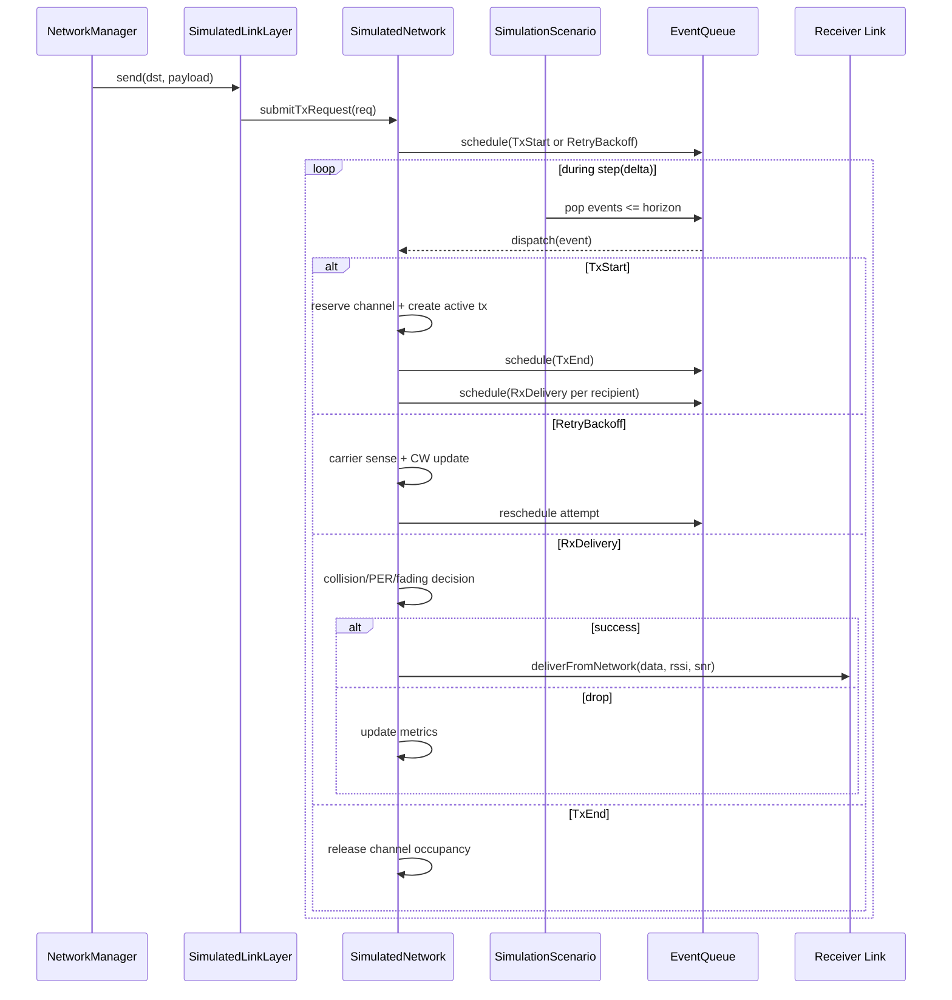

@page simulation_wireless_upgrade_design Wireless Simulation Upgrade Design

@tableofcontents

## 1. Goals and Non-Goals

### 1.1 Goals

- Add realistic medium-access and channel behavior while preserving deterministic, seed-reproducible runs.
- Keep existing layered architecture: `SimulationScenario` orchestrates runtime, `SimulatedNetwork` remains radio core model.
- Preserve current tests by default through backward-compatible configuration defaults.
- Scale to large host simulations (100+ nodes, long stepped runs) with bounded overhead.

### 1.2 Non-Goals (for this upgrade wave)

- Full PHY waveform simulation.
- Real-time wall-clock scheduling.
- Terrain/obstacle ray tracing.
- Refactoring `NetworkManager` business logic unless strictly required for MAC integration.

## 2. High-Level Architecture Changes

Current model is immediate delivery in `SimulatedNetwork::transmit(...)` with deterministic path-loss checks.
Target model introduces a deterministic event-driven channel timeline with explicit medium occupancy and transmission durations.

### 2.1 Proposed runtime layers after upgrade

- Scenario Orchestration Layer
  - `SimulationScenario` owns and advances virtual time.
  - `SimulationScenario` drives deterministic event execution in time order during `step(delta_ms)`.
- Channel/MAC Layer (new responsibilities)
  - `SimulatedNetwork` remains the central radio model and now owns:
    - channel state (busy windows, active transmissions),
    - event scheduling hooks for TX start/end and delivery,
    - collision and PER decisions,
    - channel metrics accounting.
- Link Adapter Layer
  - `SimulatedLinkLayer::send(...)` changes from immediate propagation call to enqueueing TX request into network MAC pipeline.
- Mobility/Location Layer
  - unchanged API; still queried at deterministic event timestamps.

### 2.2 Design decision: channel scope

- Channel occupancy model is per-frequency-channel, not a single global busy flag.
- Backward-compatible default: one logical channel using existing `runtime.carrier_freq_mhz`.
- Future-proofing: optional channel index per node/message for multi-channel scenarios.

## 3. Updated Packet Flow Pipeline (Before vs After)

### 3.1 Before

1. `NetworkManager` calls `ILinkLayer::send(...)`
2. `SimulatedLinkLayer` immediately calls `SimulatedNetwork::transmit(...)`
3. `SimulatedNetwork` snapshots nodes, computes RSSI/SNR, applies sensitivity cutoff
4. Recipients receive callback immediately

### 3.2 After

1. `NetworkManager` calls `ILinkLayer::send(...)`
2. `SimulatedLinkLayer` submits `TxRequest` to `SimulatedNetwork`
3. `SimulatedNetwork` computes carrier sense at request time:
   - if idle: schedule `TxStartEvent` at current virtual time
   - if busy: schedule retry/backoff event using deterministic seeded RNG
4. `SimulationScenario::step(...)` advances clock and drains event queue up to step horizon
5. `TxStartEvent`:
   - reserve channel occupancy window
   - register active transmission record
   - schedule `TxEndEvent`
   - schedule per-recipient `RxDeliveryEvent` at propagation delay offset
6. Collision/PER/noise/fading are evaluated at delivery or TX end depending on selected model
7. Successful deliveries invoke `SimulatedLinkLayer::deliverFromNetwork(...)`
8. Metrics are updated continuously (attempts, collisions, delivery, latency, utilization)

## 4. New and Updated Components

## 4.1 New components

- `SimulationEventQueue` (deterministic scheduler)
  - Min-heap ordered by `(time_us, priority, sequence_id)`.
  - Deterministic tie-break with monotonic `sequence_id`.
  - Supports event cancelation by token (optional, useful for dropped retries).

- `ChannelStateTable`
  - Maintains per-channel busy window and active transmissions.
  - Fast carrier-sense checks.
  - Collision overlap tracking.

- `MacNodeState`
  - Per-node contention state:
    - CW min/max,
    - retry count,
    - current backoff slots,
    - pending outbound queue depth.

- `DeterministicRngService`
  - Central seeded random source with deterministic substreams.
  - Supports:
    - MAC backoff draws,
    - PER Bernoulli draws,
    - fading/noise perturbations.

- `SimulationMetricsCollector`
  - Runtime counters and histogram-like summaries.
  - Exposed via `SimulationScenario` read APIs.

## 4.2 Updated existing components

- `SimulationScenario`
  - Owns scheduler tick loop integration in `step(delta_ms)`.
  - Exposes metrics snapshot API.

- `SimulatedNetwork`
  - Adds request ingress API (enqueue TX request).
  - Adds event handlers:
    - onTxStart
    - onTxEnd
    - onRetryBackoff
    - onRxDelivery
  - Adds collision/PER/fading logic.

- `SimulatedLinkLayer`
  - `send` becomes enqueue + status return; no immediate fan-out.
  - RX callback contract remains unchanged.

- `SimulationConfig` and `ConfigLoader`
  - Add runtime and radio/MAC knobs with backward-compatible defaults.

## 5. Core Data Structures (Pseudocode)

    enum class SimEventType {
      TxStart,
      TxEnd,
      RetryBackoff,
      RxDelivery
    };

    struct SimEvent {
      uint64_t time_us;
      uint8_t priority;           // lower = earlier within same timestamp
      uint64_t sequence_id;       // deterministic tie-break
      SimEventType type;
      uint16_t node_id;
      uint32_t tx_id;
      uint16_t dst_id;            // optional for unicast events
    };

    struct TxRequest {
      uint32_t tx_id;
      uint16_t src_node_id;
      uint16_t dst_id;
      std::vector<uint8_t> payload;
      uint64_t requested_at_us;
      uint8_t max_retries;
      uint8_t attempt_index;
      uint8_t channel_index;
    };

    struct ActiveTransmission {
      uint32_t tx_id;
      uint16_t src_node_id;
      uint8_t channel_index;
      uint64_t start_us;
      uint64_t end_us;
      float tx_power_dbm;
      bool collided;
    };

    struct ChannelState {
      uint64_t busy_until_us;
      std::vector<uint32_t> active_tx_ids;
      uint64_t busy_accumulated_us;
      uint64_t last_utilization_update_us;
    };

    struct MacNodeState {
      uint16_t node_id;
      uint16_t cw_min;
      uint16_t cw_max;
      uint16_t cw_current;
      uint8_t retry_count;
      uint64_t next_eligible_tx_us;
    };

    struct SimulationMetricsSnapshot {
      uint64_t tx_attempts;
      uint64_t tx_success;
      uint64_t tx_fail_collision;
      uint64_t tx_fail_per;
      uint64_t retransmissions;
      uint64_t rx_delivered;
      uint64_t rx_dropped;
      double packet_delivery_ratio;
      double average_latency_ms;
      double channel_utilization_pct;
    };

## 6. Time Model and Determinism

### 6.1 Internal time precision

- Keep existing external API in milliseconds (`step(delta_ms)`, `nowMs()` compatibility).
- Add internal microsecond timeline for radio events (`time_us`) to model:
  - transmission duration,
  - slot timing,
  - propagation delay.

### 6.2 Deterministic ordering rules

Events execute in strict order:

1. `time_us` ascending
2. event-type priority (control before delivery when equal timestamp)
3. `sequence_id` ascending

Recommended event-type priority at identical timestamp:

- `TxEnd` before `TxStart` before `RetryBackoff` before `RxDelivery`

This avoids ambiguous occupancy transitions at exact boundaries.

### 6.3 Randomness determinism

- Single scenario seed from config (`runtime.random_seed`).
- Derive deterministic substreams by stable tuple hashing:
  - `(seed, node_id, tx_id, purpose_tag)`
- Avoid consuming random numbers in nondeterministic loop orders.
- Optional stronger guarantee: stateless random function for each draw key.

## 7. Feature Designs

### 7.1 Channel Occupancy (Carrier Sense)

- Maintain `ChannelState.busy_until_us` and active tx set per channel.
- Carrier-sense check at TX attempt time:
  - idle if `now_us >= busy_until_us` and active set empty.
  - busy otherwise.
- On TX start, set `busy_until_us = max(busy_until_us, tx_end_us)`.

Thread safety:

- Continue mutex protection inside `SimulatedNetwork` for shared state.
- Event execution and state mutation happen in scheduler-driven deterministic context.

### 7.2 Transmission Time Modeling

Introduce airtime formula:

    tx_duration_us = preamble_us +
                     ceil((phy_overhead_bytes + payload_len_bytes) * 8e6 / data_rate_bps)

Configurable terms:

- `data_rate_bps`
- `phy_overhead_bytes`
- `preamble_us`

Behavior:

- delivery is no longer instantaneous;
- `TxEndEvent` marks channel release;
- receiver delivery scheduled at `TxStart + propagation_delay + rx_processing_offset`.

### 7.3 Event Scheduling System

Placement decision:

- Scheduler owned by `SimulationScenario`.
- `SimulatedNetwork` registers events through scheduler interface.

Rationale:

- Keeps virtual-time authority in scenario.
- Allows future non-radio event types (mobility triggers, scripted faults) without cyclic dependencies.

### 7.4 Random Backoff (CSMA/CA-like)

Per-node algorithm:

1. If channel busy, draw slot count `k` from `[0, cw_current]`.
2. Schedule retry at `now + DIFS + k * slot_time_us`.
3. On retry failure, increase CW exponentially:
   - `cw_current = min((2 * cw_current + 1), cw_max)`
4. On success, reset to `cw_min`.
5. Stop after `max_retries` and count failure.

Config parameters:

- `slot_time_us`
- `difs_us`
- `cw_min`
- `cw_max`
- `max_retries`

### 7.5 Collision Detection

Baseline strategy for first rollout:

- If two or more transmissions overlap in time on same channel and both are receivable at a node, mark collided and drop affected receptions.

Optional enhancement (phase 2+): capture effect

- If strongest signal exceeds second-strongest by `capture_threshold_db`, allow decode.

Complexity control:

- Only compare against currently active transmissions in channel state.
- Avoid all-pairs over historical transmissions.

### 7.6 Packet Error Model (PER)

Support model modes:

- `threshold` (legacy-like deterministic): success if `snr_db >= snr_min_db`.
- `logistic`: `p_success = 1 / (1 + exp(-k*(snr_db - snr_mid_db)))`.
- `table`: piecewise-linear interpolation from configured SNR/PER points.

Delivery decision:

- deterministic RNG draw `u` in [0,1)
- success if `u < p_success`

### 7.7 Channel Noise and Fading

Add small stochastic terms before PER decision:

- `rssi_eff = rssi_nominal + fade_db + noise_jitter_db`
- defaults keep current behavior (`fade_stddev_db = 0`, `noise_jitter_db = 0`).

Initial model:

- zero-mean bounded gaussian-like perturbation (clamped)
- optional slowly varying noise floor process by channel

### 7.8 Propagation Delay

Delay model:

    propagation_delay_us = max(min_delay_us,
                               round(distance_m / c_m_per_s * 1e6))

Defaults:

- `min_delay_us = 0` for strict legacy alignment.
- optional non-zero minimum to avoid same-timestamp artifacts.

### 7.9 Channel Utilization and Congestion

- Track busy-time accumulation per channel:
  - integrate occupied intervals during event execution.
- expose utilization as:

    utilization = busy_time_us / elapsed_time_us

Optional congestion drop model (feature-gated):

- if utilization over rolling window exceeds threshold, apply extra drop probability.

### 7.10 Metrics Collection API

Expose from scenario:

- snapshot query:
  - `SimulationMetricsSnapshot SimulationScenario::metrics() const`
- optional reset:
  - `void SimulationScenario::resetMetrics()`

Metrics include:

- packet delivery ratio
- latency (mean, min/max, optional percentiles)
- collision count
- retransmission count
- channel utilization

### 7.11 Config Extensions

Runtime additions (example):

- `random_seed` (uint64)
- `scheduler_time_unit` (fixed internally, optional read-only)
- `data_rate_bps`
- `phy_overhead_bytes`
- `preamble_us`
- `slot_time_us`
- `difs_us`
- `cw_min`, `cw_max`, `max_retries`
- `per_model` and model coefficients/table
- `fading_stddev_db`, `noise_jitter_db`
- `propagation_min_delay_us`
- `enable_collision_model`
- `enable_congestion_drops`

Node/radio optional additions:

- `channel_index`
- `capture_threshold_db`

Backward compatibility:

- defaults selected to emulate current behavior:
  - collision disabled,
  - PER threshold pass-through,
  - zero jitter/fading,
  - immediate-like minimal durations if desired in compatibility profile.

## 8. Interaction Diagram

## 9. Incremental Integration Plan

### Phase 0: Compatibility scaffolding

- Add config fields with defaults preserving current behavior.
- Add metrics collector skeleton and API getters returning baseline values.
- No behavior changes yet.

Exit criteria:

- all existing simulation tests pass unchanged.

### Phase 1: Deterministic event queue foundation

- Introduce scheduler and event types.
- Route `SimulatedLinkLayer::send` through request queue.
- Keep immediate-delivery compatibility mode enabled by default.

Exit criteria:

- deterministic replay test added and passing.
- phase 3/4/5 tests remain green.

### Phase 2: TX duration + channel occupancy

- Add airtime computation and busy window tracking.
- Implement carrier-sense gate and TX start/end events.
- Add simple backoff without exponential growth first.

Exit criteria:

- channel busy tests passing.
- no regression in base functionality under compatibility config.

### Phase 3: CSMA/CA backoff + collisions

- Add CW growth/reset and retry caps.
- Add overlap-based collision drops.
- Add collision metrics.

Exit criteria:

- targeted collision and retransmission tests passing.

### Phase 4: PER + fading + noise + propagation delay

- Add probabilistic delivery model and deterministic RNG integration.
- Enable delay-aware delivery scheduling.
- Add reproducibility checks with fixed seeds.

Exit criteria:

- repeated runs with same seed produce identical snapshots.
- different seeds produce expected statistical variation.

### Phase 5: Utilization + congestion model + optimization

- Add utilization accounting and optional congestion drops.
- Profile and optimize active-transmission scanning and scheduler hot paths.

Exit criteria:

- performance budget sustained for 100-node stress scenarios.

## 10. Risks and Trade-offs

- Increased complexity in event ordering
  - Mitigation: strict ordering tuple and centralized scheduler tests.
- Potential nondeterminism from asynchronous manager threads
  - Mitigation: all channel decisions happen in deterministic event loop, stable tie-break keys, seeded stateless draws.
- Performance overhead from collision checks
  - Mitigation: per-channel active set only, avoid historical scans, feature flags for heavy models.
- Backward compatibility risk for timing-sensitive tests
  - Mitigation: compatibility profile defaults and phased opt-in tests.
- Config bloat
  - Mitigation: grouped config blocks, sensible defaults, parser validation with clear errors.

## 11. Testing Strategy

### 11.1 Unit tests (new)

- Scheduler ordering and tie-break determinism.
- Airtime calculation correctness.
- Carrier-sense state transitions.
- Backoff CW growth/reset logic.
- PER mapping function correctness.
- Seed reproducibility for RNG service.

### 11.2 Integration tests (simulation)

- Existing phase 3/4/5 regression suite under compatibility defaults.
- New CSMA tests:
  - busy-channel defer,
  - retry then success,
  - retry exhaustion.
- Collision tests:
  - overlapping TX causes drop,
  - optional capture threshold behavior.
- Propagation tests:
  - farther node receives later than closer node (when delay enabled).

### 11.3 Determinism tests

- same seed + same workload => identical per-node message hashes and metrics.
- seed change => reproducible but different statistical outcomes.
- run-to-run equality across multiple repetitions in CI.

### 11.4 Performance tests

- maintain or improve current phase-5 step budget constraints.
- add profile scenarios for high contention and high event density.

## 12. Small, Testable Commit Suggestions

1. Commit A: Config and API scaffolding
   - Add new config fields with defaults.
   - Add metrics snapshot structs and no-op collector wiring.

2. Commit B: Deterministic event queue core
   - Add scheduler, event IDs, and deterministic ordering tests.

3. Commit C: Link-layer send path migration
   - Route send through request enqueue.
   - Keep compatibility immediate mode active.

4. Commit D: TX duration and carrier-sense occupancy
   - Implement TxStart/TxEnd events and busy window tests.

5. Commit E: Backoff and retry policy
   - Add per-node CW state and retry scheduling tests.

6. Commit F: Collision model (drop-on-overlap)
   - Add active transmission overlap checks and collision metrics tests.

7. Commit G: PER and fading/noise model
   - Add SNR-to-probability mapping and seeded probabilistic tests.

8. Commit H: Propagation delay and utilization metrics
   - Add delay scheduling and channel busy percentage accounting.

9. Commit I: Integration and documentation updates
   - Extend simulation test matrix.
   - Update architecture docs with operational examples.
